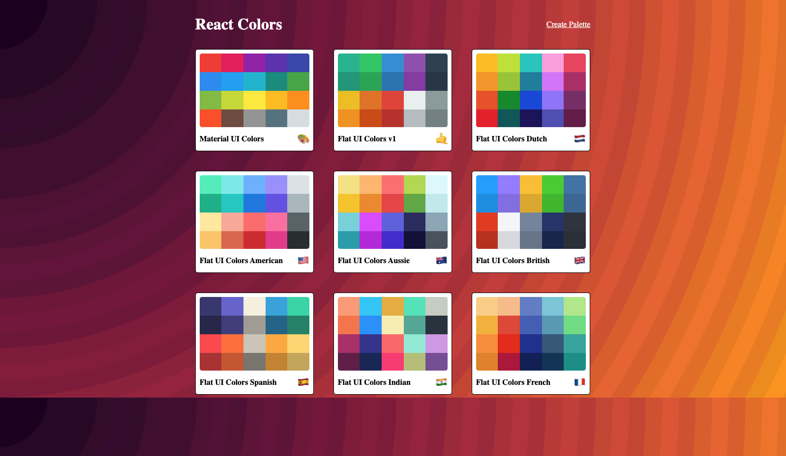

# Color-Me-React

## Project Overview

A Flat UI Colors clone where users can choose different palettes and copy specific colors in HEX and RGBA format.

  <b>Preview the Color-Me-React App:</b> 
  <a href="https://zealous-dijkstra-8a5c7a.netlify.app/">Click Here</a> 
    
  

